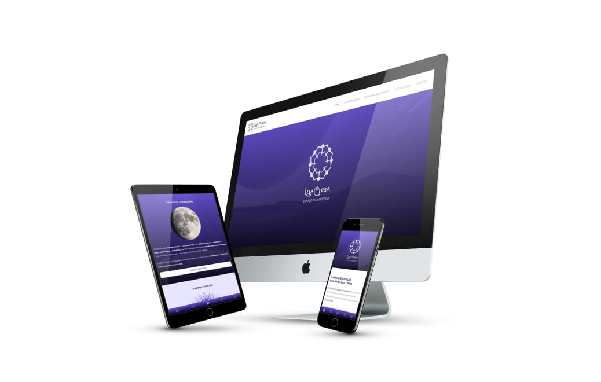

# Lua Cheia Espaço Terapêutico Website

<h4>Website 100% componentizado, desensolvido com Figma, ReactJS e SCSS</h4>

<h3>

</h3>

Acesse o resultado final no meu site: https://wagnermello.com/lua-cheia

<b>OBS:</b> Utilizei o SCSS App Resizer (desenvolvido por mim). Portanto o site está escalando as suas proporções perfeitamente até 8K. Experimente dar um zoom out para testar a resolução em telas gigantes.

#

Acesse o projeto no Figma (desenvolvido por mim):

Rebranding: https://www.figma.com/file/dnfjlSKSNQLe1tNO5X5hQl/Lua-Cheia-Espa%C3%A7o-Terap%C3%AAutico?node-id=76%3A37

Logo: https://www.figma.com/file/dnfjlSKSNQLe1tNO5X5hQl/Lua-Cheia-Espa%C3%A7o-Terap%C3%AAutico?node-id=3%3A547

Desktop Website: https://www.figma.com/file/dnfjlSKSNQLe1tNO5X5hQl/Lua-Cheia-Espa%C3%A7o-Terap%C3%AAutico?node-id=6%3A207

Mobile Website: https://www.figma.com/file/dnfjlSKSNQLe1tNO5X5hQl/Lua-Cheia-Espa%C3%A7o-Terap%C3%AAutico?node-id=35%3A217

